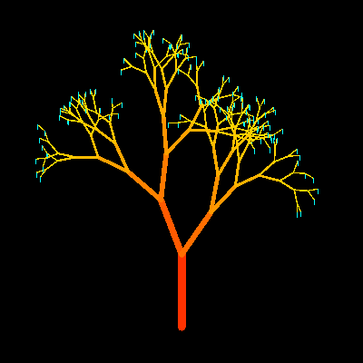

# Tree Generator


This program uses features from [Random Trees](tree2.md) to generate a series of 'natural' looking trees. It does this by using 
three parameters:  

1) **RandomAng** This can be one of 8 values between 24 and 80 
degrees. It determines the angle between two branches and is the same 
for the whole tree.  

2) **RanTreeAng** This can be one of 5 values between 1/4 and 3/4 
of the RandomAng. It determines the angle from the end of one branch 
to the next drawn tree. It is different for each new tree.  

3) **RanBraLen** This can be one of 3 values 0.7, 0.75 or 0.8. 
It determines how much shorter branches in the next tree are. It is 
different for each new branch.

```logo
To New
 # set default screen, pen and turtle values
 ResetAll SetScreenSize [400 400] HideTurtle
 SetSC Black SetPC Green SetPS 1 PenUp
End
To TreeCol :Length
 Make "Green Round 2.5*(100-:Length) # green depends on length
 Output ( List 255 :Green 0 ) # red set to 255 and blue to 0
End
To Tree :Length
 If :Length< 10 [Blossom Stop] # ends recursion if branch too small
 SetPW :Length/9 # reduce pen width as branch length gets smaller
 SetPC TreeCol :Length # branch color depends on length
 LocalMake "Angle Pick [24 32 40 48 56 64 72]
 LocalMake "TreeAngle :Angle*Pick [0.25 0.375 0.5 0.625 0.75]
 Forward :Length
 Left :TreeAngle
 Tree :Length * Pick [0.7 0.75 0.8] Right :Angle
 Tree :Length * Pick [0.7 0.75 0.8] Left :Angle
 Right :TreeAngle
 PenUp Back :Length PenDown # return to starting point
End
To Blossom
 Make "myPenCol PenColor Make "myHeading Heading
 SetPC 6 SetH 180
 Forward 5 Back 5 SetPC :myPenCol SetH :myHeading
End
To Go
 Repeat 99 [ New Back 160 PenDown Tree 80 Wait 200]
End
```
