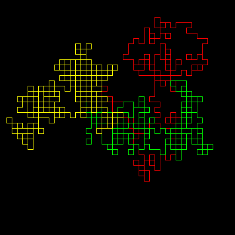

# Friendship Series


This is a mathematical series of numbers generated in a rather odd way.

```logo
To New
 # set default screen, pen and turtle values
 ResetAll SetScreenSize [400 400] HideTurtle
 SetSC Black SetPC Green SetPS 1 PenUp
End
To Friendship :Series
 Make "NewSeries [ ]
 Make "LastItem Item 1 :Series
 Make "ThisCount 0
 For (List "N 1 Count :Series) [
 Make "ThisItem Item :N :Series
 If :ThisItem = :LastItem
 [Make "ThisCount :ThisCount+1]
 [Make "NewSeries LPut :ThisCount :NewSeries
 Make "NewSeries LPut :LastItem :NewSeries Make "ThisCount 1]
 Make "LastItem :ThisItem]
 Make "NewSeries LPut :ThisCount :NewSeries
 Make "NewSeries LPut :ThisItem :NewSeries
 Output :NewSeries
End
To Draw :Series
 For (List "N 1 (Count :Series)-1) [
 If (Item :N :Series) = 1 [Left 90]
 If (Item :N :Series) = 2 [Right 90]
 Forward 9]
End
To Generate :N
 Make "Series [X]
 Repeat :N [
 Make "Series Friendship :Series]
 Print :Series
 Draw :Series
End
To Go
 New Repeat 3 [
 SetPC RepCount PenUp Home PenDown Right 90
 Generate 18+RepCount]
End
```
