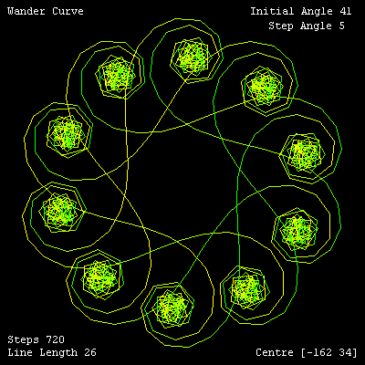

# Wander Curves


This produces the same patterens as [Wanderer](wandhappy.md). 
However, they are optimised (scaled) to fit the XLogo graphics window. 
Also drawn in color with information display.

Only the initial and step angles need defining. For example, enter **Go 
25 57**. The number of steps needed to return to the starting position 
is calculated by the procedure Cycles.  

You'll see the wander curve drawn in gray.  

If the trail doesn't return to its starting position after 720 steps, 
a trail of 720 steps is drawn. Usually, you'll see the trail is 
'linear', wandering off to infinity.

Then the trail is redrawn and the origin and line_length (LL) are calculated 
to fit the trail to the screen by the Fit2Screen procedure. This is identical to the procedure used in [Tangle 
Curves](wandtangle.md).

Then the screen is cleared. The Display procedure 
draws the final values of the variables used. Then the final curve is 
drawn using colored pens.

```logo
To New
 # set default screen, pen and turtle values
 ResetAll SetScreenSize [400 400] HideTurtle
 SetSC Black SetPC Green SetPS 1 PenUp
End
To Cycles :IA2 :SA :LL
 Make "A Pos
 PenDown Repeat 720 [
 Forward :LL Right :IA2 Make "IA2 :IA2+:SA
 If (And (Round First Pos)=0 (Round Last Pos)=0 (Round Heading)=0)
 [Output RepCount] ]
 Output 720 # curve never closed
End
To Fit2Screen :IA :SA :LL :CY
 Make "IA3 :IA
 PenUp Home
 Make "Xmax 0 Make 
 "Xmin 0
 Make "Ymax 0 Make 
 "Ymin 0
 Repeat :CY [Forward :LL Right :IA3 Make "IA3 :IA3+:SA
 If X > :Xmax [Make "Xmax X]
 If X < :Xmin [Make "Xmin X]
 If Y > :Ymax [Make "Ymax Y]
 If Y < :Ymin [Make "Ymin Y] ]
 Make "Xsize :Xmax + Abs :Xmin
 Make "Ysize :Ymax + Abs :Ymin
 If :Xsize=:Ysize | :Xsize>:Ysize
 [Make "Size :Xsize] [Make "Size :Ysize]
 Make "Scale 360/:Size
 Make "LengthNew :LL*:Scale
 If ((Abs (:LengthNew - :LL))>:LL/10) [
 Make "LL :LengthNew Fit2Screen :IA :SA :LL :CY]
 Make "Xcent Minus Round (:Xmax + :Xmin) / 2
 Make "Ycent Minus Round (:Ymax + :Ymin) / 2
End
To Display :IA :SA :LineLength :CY
 Home SetPC White
 SetPos [-192 184] Label [Happy Wanderer]
 SetPos [74 184] Label Sentence [Initial Angle] :IA
 SetPos [94 168] Label Sentence [Step Angle] :SA
 SetPos [-192 -176] Label Sentence [Steps] :CY
 SetPos [-192 -190] Label Sentence [Line Length] Round :LineLength
 SetPos [80 -190] Label List "Centre List :Xcent :Ycent
End
To AngCol
 Make "Red 255*Sin Heading/2
 Output ( List :Red 255 0 )
End
To Go :IA :SA
 New SetPC Gray
 Make "LL 15 # default line length
 Make "CY Cycles :IA :SA :LL
 Fit2Screen :IA :SA :LL :CY
 New Display :IA :SA :LengthNew :CY
 SetXY :Xcent :Ycent SetH 0 PenDown
 Circle 2 # circle starting position
 Repeat :CY [
 SetPC AngCol Forward :LengthNew Right :IA
 Make "IA :IA+:SA]
End
```

Type **go ia sa** to run.

Do any whole number curves need more than 720 steps to complete?  

I don't know which IA SA values produce the 'best' curves. So far, 
many random geusses, but let me know any interesting curves 
you find and I'll add them to this list.

- IA = 1 SA = 20, 21, 30, 51, 52  
- IA = 10 SA = 27, 80  
- IA = 11 SA = 32, 53, 66, 80  
- IA = 12 SA = 80  
- IA = 21 SA = 20, 44  
- IA = 22 SA = 21, 25  
- IA = 25 SA = 27, 33, 51, 57, 63  
- IA = 31 SA = 30, 32, 33, 39  
- IA = 33 SA = 44  
- IA = 34 SA = 70  
- IA = 40 SA = 30  
- IA = 41 SA = 3  
- IA = 43 SA = 57  
- IA = 5 SA = 33  
- IA = 73 SA = 100

Curves can be simplified. eg. Curve 65 44 is the same as curve 21 44 etc.

Let me know if you find a longer line length than 75 used in 61 30.
