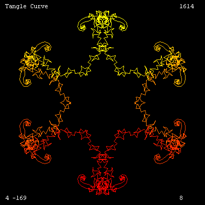

# Tangle Curves


Tangle curves are derived from the function:  

360 * (Power **:**I 3) /**:**N  

Try out the following code (copy and paste into the command line);

CS For [I 0 141] [SetH (360*(Power **:**I 3)/141) Forward 16]

You'll get a tangle curve of order 141.  

For another curve, change both values of 141 in the above code to 1013.  

So why is this program so much longer ?  

Well, if you replace both values with a different number, you'll get a 
new curve. However, most curves will appear too large or too small, or 
be drawn off screen.  

Therefore, this program includes a Fit2Screen procedure, which calculates the line length and starting position to best 
fit the curve in the 400x400 window.  

You can comment out the Fit2Screen procedure 
to see its effect.

```logo
To New
 # set default screen, pen and turtle values
 ResetAll SetScreenSize [400 400] HideTurtle
 SetSC Black SetPC Green SetPS 1 PenUp
End
To Tangle :N
 Make "LengthNew 16
 Fit2Screen :N :LengthNew # comment out to skip curve optimisation
 Wash Display :N :Xcent :Ycent :LengthNew
 SetXY :Xcent :Ycent PenDown
 For (List "I 0 :N) [
 SetPC AngCol :I :N
 SetH Function :I :N Forward :LengthNew]
 PenUp
End
To Fit2Screen :N :Length
 Home
 Make "Xmax 0 Make "Xmin 0
 Make "Ymax 0 Make "Ymin 0
 For (List "I 0 :N) [
 SetH Function :I :N Forward :Length
 If (X) > :Xmax [Make "Xmax X]
 If (X) < :Xmin [Make "Xmin X]
 If (Y) > :Ymax [Make "Ymax Y]
 If (Y) < :Ymin [Make "Ymin Y] ]
 Make "Xsize :Xmax + Abs :Xmin
 Make "Ysize :Ymax + Abs :Ymin
 If :Xsize=:Ysize | :Xsize>:Ysize
 [Make "Size :Xsize] [Make "Size :Ysize]
 Make "Scale 360/:Size
 Make "LengthNew :Length*:Scale
 If ((Abs (:LengthNew - :Length))>:Length/10) [
 Make "Length :LengthNew Fit2Screen :N :Length]
 Make "Xcent Minus (:Xmax + :Xmin)/2
 Make "Ycent Minus (:Ymax + :Ymin)/2
End
To Function :I :N
 Output (360*(Power :I 3)/:N)-90
End
To Display :N :Xcent :Ycent :LengthNew
 # write header and footer info
 SetH 0 SetPC White
 SetPos [-190 184] Label [Tangle Curve]
 SetPos [150 184] Label :N
 SetPos [-190 -190] Label List Round :Xcent Round :Ycent
 SetPos [150 -190] Label Round :LengthNew
End
To AngCol :I :N
 Make "Green Round 255*(Sin 180*:I/:N)
 Output ( List 255 :Green 0 )
End
To Go
 # draw random tangle curves
 New Forever [Tangle Random 2048 Wait 88]
End
```

Add the procedure **GoC** to draw tangle curves from order 
1 onwards. Or alter to spicify your own range.  

Add the procedure **GoX** followed by the order number to 
draw a specific tangle curve. Why not try out the curve for your year 
of birth?

```logo
To GoC
 # draw tangle curves of order 1 to 2048
 New For [N 1 2048] [Tangle :N Wait 100]
End
To GoX :N
 # draw a specific tangle curve of order N
 New Tangle :N
End
```

In the function procedure, try changing the power value from 3 (shown in red) to 5 for a whole new set of tangle 
curves.  

Note that a value of 1 will create closed polygons of **N** sides, best seen with the **GoC** procedure.
